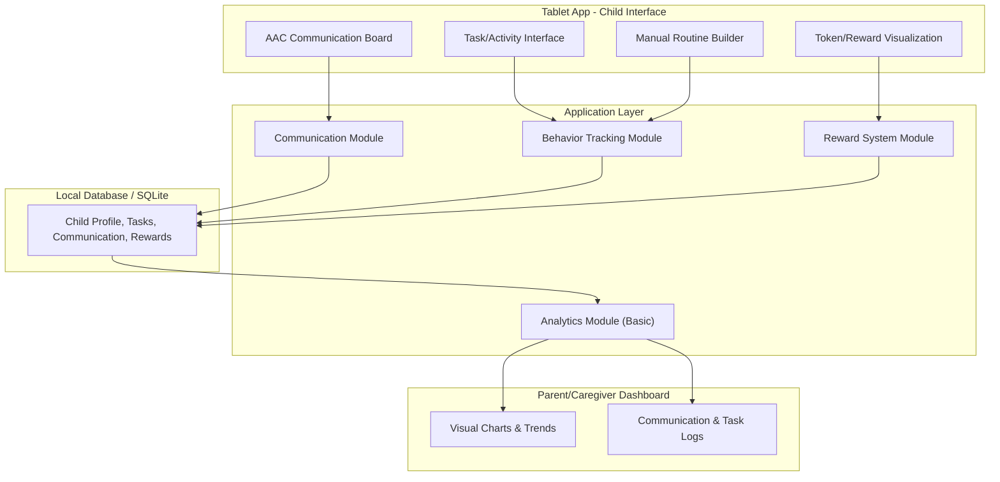

# AuXel – Architecture & Spectrum-Wide Display

This document describes the intended application architecture and how the app is designed to support **people all over the autism spectrum**—different support levels, sensory needs, and communication abilities.

---

## System Architecture

---

## Current Implementation Mapping

| Architecture component | Current implementation |
|------------------------|------------------------|
| **AAC Communication Board** | Child Tablet → **Talk** tab: large buttons for need, distress, refusal, help; logs to Communication Module. |
| **Task/Activity Interface** | Child Tablet → **Learn** (prompts) and **Play** (games); driven by skill assessment complexity and domain focus. |
| **Token/Reward Visualization** | Not yet implemented; planned for Reward UI and Reward Module. |
| **Manual Routine Builder** | Not yet implemented; planned for Routine UI and Task Module. |
| **Communication Module** | Session logs for communication events; API and storage for child profile and prompts. |
| **Behavior Tracking Module** | Session logs (prompt responses, game rounds); skill assessment and profile drive Learn/Play. |
| **Reward System Module** | Planned; no DB tables yet. |
| **Analytics Module** | Basic: session logs aggregated for dashboard; charts and logs views. |
| **Data Layer** | PostgreSQL (or in-memory fallback); tables: `child_profiles`, `session_logs`, `prompts`, `skill_assessments`. |
| **Dashboard – Charts & Logs** | Overview (charts), Logs (activity), Configuration (profile + assessment). |

---

## Display for People All Over the Spectrum

The app serves users across the full autism spectrum. **How we display and adapt the interface** is as important as the architecture.

### 1. **Child tablet (child-facing)**

- **Complexity levels**  
  Content and difficulty are driven by the **skill assessment** (recommended complexity and domain scores). Lower support needs → more options and steps; higher support needs → fewer, clearer choices and stronger structure.

- **Sensory and access**
  - **Sound**: Optional TTS and sound effects; can be turned off or reduced (profile: `sensoryPreferences.sound`).
  - **Visual**: Feedback (toasts, highlights) can be disabled (`visualFeedback: false`) for sensitivity.
  - **Motion**: Animations and transitions should stay minimal and optional where possible.
  - **Layout**: Large touch targets, clear labels, and consistent placement so the same actions stay in the same place.

- **Communication**
  - AAC-style board is the primary way to express needs (want, no/stop, feel bad, help).
  - Learn/Play are optional and can be hidden (`interfaceType: 'simple'`) for a communication-only experience.
  - Copy and visuals avoid figurative language and keep language literal and predictable.

- **Tasks and routines (planned)**
  - Task/Activity and Routine Builder will support visual schedules and step-by-step flows.
  - Display should scale: from single-step “one thing now” to multi-step routines, depending on profile/assessment.

- **Rewards (planned)**
  - Token/reward display must be simple and unambiguous (e.g. clear count, clear “done” state).
  - Avoid flashing or automatic animation; prefer caregiver-controlled or low-motion feedback.

### 2. **Caregiver dashboard**

- **Clarity over clutter**  
  Charts and logs should answer: “What did my child do?” and “What’s the trend?” without requiring prior analytics experience.

- **Language**  
  Use plain language and, where relevant, the same terms used in the skill assessment (e.g. support tier, domain names) so caregivers can align with reports and professionals.

- **Spectrum-aware defaults**  
  Defaults (e.g. complexity, sensory preferences) should be safe for more sensitive users; caregivers can increase stimulation or complexity if needed.

### 3. **Data and personalization**

- **One profile per child**  
  All display and behavior (complexity, themes, sensory prefs, interface type) are per child profile so the same app can serve siblings or classrooms with different needs.

- **Assessment drives experience**  
  Skill assessment results explicitly control:
  - Which prompts and how many game rounds (Learn/Play).
  - Ordering of content by domain (e.g. more support in communication → communication-first prompts).
  - Recommended complexity level used across the tablet until the caregiver changes it.

- **Future: tasks, routines, rewards**  
  When Task/Activity, Routine Builder, and Reward UI are implemented, they will:
  - Read/write through the same data layer (DB).
  - Respect the same profile and assessment settings (complexity, sensory, interface type).
  - Expose only the level of structure (e.g. number of steps, tokens) appropriate to the child’s assessed level.

---

## Summary

- **Architecture**: Tablet (AAC, Tasks, Reward UI, Routine UI) → Application modules (Communication, Behavior Tracking, Reward, Analytics) → Database → Dashboard (Charts, Logs).
- **Spectrum-wide display**: Every child-facing screen is driven by **profile + skill assessment** (complexity, domains, sensory preferences, interface type). Caregiver-facing screens stay clear and consistent so the same system works for people all over the spectrum.
